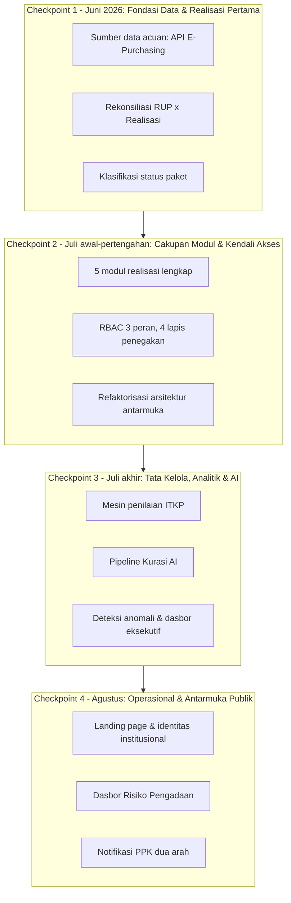

# 🏛️ DEWA-PBJ — Dokumentasi Teknis Pembangunan Sistem

> **DEWA-PBJ** (*Early Warning Pengadaan*) — sistem pemantauan dan tata kelola Pengadaan Barang/Jasa untuk UKPBJ Kementerian Ketenagakerjaan.

|                              |                                                                                                        |
| ---------------------------- | ------------------------------------------------------------------------------------------------------ |
| **Disusun untuk**      | Pimpinan dan Tim Teknis UKPBJ Kementerian Ketenagakerjaan                                              |
| **Tanggal Penyusunan** | 24 Agustus 2026                                                                                        |
| **Cakupan**            | Seluruh pengembangan sejak inisialisasi proyek (24 Juni 2026) hingga kondisi terkini (20 Agustus 2026) |
| **Cabang Acuan**       | `rework-pengadaan`                                                                                   |
| **Sifat Dokumen**      | Laporan teknis menyeluruh, disusun dalam empat checkpoint pengembangan                                 |

---

## Daftar Isi

1. [Tentang Sistem](#1-tentang-sistem)
2. [Arsitektur &amp; Tumpukan Teknologi](#2-arsitektur--tumpukan-teknologi)
3. [Peta Perjalanan Pengembangan](#3-peta-perjalanan-pengembangan)
4. [Checkpoint 1 — Fondasi Data &amp; Realisasi Pertama](#4-checkpoint-1--fondasi-data--realisasi-pertama)
5. [Checkpoint 2 — Cakupan Modul &amp; Kendali Akses](#5-checkpoint-2--cakupan-modul--kendali-akses)
6. [Checkpoint 3 — Tata Kelola, Analitik &amp; Kecerdasan Buatan](#6-checkpoint-3--tata-kelola-analitik--kecerdasan-buatan)
7. [Checkpoint 4 — Operasional, Manajemen Risiko &amp; Antarmuka Publik](#7-checkpoint-4--operasional-manajemen-risiko--antarmuka-publik)
8. [Peta Modul &amp; Kendali Akses Saat Ini](#8-peta-modul--kendali-akses-saat-ini)
9. [Model &amp; Alur Data](#9-model--alur-data)
10. [Status Teknis Saat Ini &amp; Rencana Penguatan](#10-status-teknis-saat-ini--rencana-penguatan)

---

## 1. Tentang Sistem

DEWA-PBJ mengonsolidasikan data pengadaan dari sumber resmi ekosistem pengadaan pemerintah — SIRUP, SPSE/e-Katalog (E-Purchasing) — yang telah melalui proses ETL ke Supabase, kemudian menyajikannya sebagai satu lapisan analitik bagi tiga kelompok pengguna: **Administrator UKPBJ**, **Sekretariat Jenderal**, dan **PPK**. Sistem ini mencakup enam kapabilitas inti: pemantauan realisasi lintas metode pengadaan, keterisian rencana pengadaan (RUP), penilaian tata kelola (ITKP), kurasi kepatuhan berbasis kecerdasan buatan, deteksi anomali data, dan manajemen risiko pengadaan.

Pembangunan sistem berlangsung sejak 24 Juni 2026 hingga saat ini melalui 226 commit pada cabang `rework-pengadaan`, dilaksanakan secara bertahap (*incremental development*). Dokumen ini menyusun keseluruhan riwayat pengembangan tersebut ke dalam empat checkpoint, masing-masing merepresentasikan satu lapisan arsitektur yang dibangun di atas lapisan sebelumnya.

---

## 2. Arsitektur & Tumpukan Teknologi

| Lapisan                  | Teknologi                              | Keterangan                                                                              |
| ------------------------ | -------------------------------------- | --------------------------------------------------------------------------------------- |
| Framework aplikasi       | Next.js 16 (App Router)                | Server Components +`"use client"` per komponen interaktif                             |
| Antarmuka                | React 19                               | —                                                                                      |
| Bahasa                   | TypeScript 5 (`strict: true`)        | —                                                                                      |
| Styling                  | Tailwind 4 + CSS Modules               | Design token berbasis variabel CSS di`globals.css`                                    |
| Basis data & autentikasi | Supabase (PostgreSQL, PostgREST, Auth) | Akses langsung dari browser untuk mayoritas modul, Route Handler untuk modul bergerbang |
| Visualisasi data         | Chart.js 4 + react-chartjs-2           | —                                                                                      |
| Animasi                  | Framer Motion 12                       | —                                                                                      |
| Kecerdasan buatan        | Google Gemini (`@google/genai`)      | Digunakan pada fitur Kurasi AI                                                          |
| Ekspor laporan           | ExcelJS, jsPDF + autoTable, file-saver | Format XLSX, CSV, dan PDF                                                               |
| Validasi skema           | Zod 4                                  | Formulir login dan skema respons AI                                                     |

---

## 3. Peta Perjalanan Pengembangan



| Checkpoint  | Periode            | Fokus Utama                                                                       |
| ----------- | ------------------ | --------------------------------------------------------------------------------- |
| **1** | 24–30 Juni 2026   | Inisialisasi aplikasi, penetapan sumber data, modul realisasi pertama             |
| **2** | 2–21 Juli 2026    | Perluasan ke lima metode pengadaan, autentikasi, dan kendali akses berbasis peran |
| **3** | 21–31 Juli 2026   | Penilaian tata kelola (ITKP), kurasi otomatis berbasis AI, deteksi anomali        |
| **4** | 1–20 Agustus 2026 | Landing page, manajemen risiko, dan sistem notifikasi                             |

---

## 4. Checkpoint 1 — Fondasi Data & Realisasi Pertama

**Periode:** 24–30 Juni 2026

Tahap ini menjadi titik awal seluruh pengembangan. Dua hal harus dituntaskan sebelum modul apa pun dapat dibangun di atasnya: kerangka aplikasi yang siap dioperasikan, dan sumber data yang dapat dipertanggungjawabkan validitasnya.

### 4.1 Fondasi Aplikasi

Aplikasi diinisialisasi menggunakan Next.js dengan pola *App Router*, dikonfigurasi sejak awal untuk *deployment* berkelanjutan ke platform Vercel. Dalam proses inisialisasi ini, sumber data acuan yang semula digunakan (data realisasi dari data.inaproc) dievaluasi dan dinyatakan tidak memenuhi kebutuhan validitas, sehingga digantikan dengan data resmi dari **API E-Purchasing** sebagai sumber tunggal (*single source of truth*) bagi seluruh perhitungan realisasi — sebuah reset menyeluruh yang dilakukan pada minggu pertama pengembangan.

### 4.2 Rekonsiliasi Data

Komponen teknis inti pada tahap ini adalah logika rekonsiliasi antara data Rencana Umum Pengadaan (RUP) yang terumumkan dan data realisasi transaksi, menggunakan operasi **`FULL OUTER JOIN`** pada lapisan basis data. Pendekatan ini memastikan setiap paket tetap tampil meskipun tidak memiliki pasangan data pada sisi lainnya, dan menjadi dasar bagi penanda **`is_from_sirup`** yang selanjutnya dipakai secara konsisten di seluruh sistem untuk membedakan paket yang memiliki rencana resmi dari yang tidak. Riwayat setiap entitas data disusun menggunakan *Common Table Expression* (CTE) untuk efisiensi kueri, sementara nilai metrik agregat dikunci pada saat pemuatan data agar tampilan tetap konsisten ketika pengguna mengubah filter.

### 4.3 Modul Realisasi E-Purchasing (Pertama)

- Fitur pencarian dan penyaringan data, dengan paket berstatus dibatalkan (*cancelled*) selalu dikeluarkan dari perhitungan.
- Tampilan hierarki tiga tingkat: Eselon I → PPK → detail paket.
- Filter lanjutan (*advanced filter*) dan pengurutan data.
- Penjumlahan realisasi dengan deduplikasi untuk mencegah penghitungan ganda.
- Klasifikasi status paket menjadi tiga kategori baku yang bertahan sepanjang proyek: **Sudah Realisasi, Proses, Belum Realisasi**.
- Filter penanda paket dengan realisasi melebihi pagu — cikal bakal fitur deteksi anomali pada Checkpoint 3.

### 4.4 Hasil Checkpoint 1

- Kerangka aplikasi Next.js dengan alur *deployment* otomatis ke Vercel.
- Sumber data resmi E-Purchasing sebagai acuan tunggal, menggantikan sumber data awal yang tidak valid.
- Logika rekonsiliasi RUP–realisasi (`FULL OUTER JOIN`, penanda `is_from_sirup`).
- Modul Realisasi E-Purchasing versi pertama, lengkap dengan filter dan klasifikasi status.
- Klasifikasi status paket tiga kategori: Sudah Realisasi, Proses, Belum Realisasi.

---

## 5. Checkpoint 2 — Cakupan Modul & Kendali Akses

**Periode:** 2–21 Juli 2026

Dengan fondasi data pada satu metode pengadaan sudah terbukti valid, tahap ini mereplikasi pola tersebut ke seluruh metode yang berlaku, sekaligus menutup satu kebutuhan yang belum ada: kendali atas siapa boleh melihat data apa.

### 5.1 Perluasan ke Lima Metode Pengadaan

Skema *view* pada basis data diperluas dari satu metode pengadaan menjadi lima, masing-masing sebagai *view* dashboard tersendiri dengan struktur kolom yang diseragamkan sehingga dapat digabungkan melalui `UNION ALL` menjadi satu *view* konsolidasi (`view_dashboard_gabungan_satker`).

| Modul               | View Sumber                            | Kekhususan Teknis                                                                          |
| ------------------- | -------------------------------------- | ------------------------------------------------------------------------------------------ |
| E-Purchasing        | `view_dashboard_epurchasing_v6`      | Dedupe per`kd_rup` di sisi klien — satu RUP dapat memiliki banyak `order_id`          |
| Tender              | `view_dashboard_tender`              | Filter 4 opsi metode; metrik tidak digerbang oleh`is_from_sirup`                         |
| Pengadaan Langsung  | `view_dashboard_pengadaan_langsung`  | Memisah`total_pencatatan` vs `total_transaksional`; metrik digerbang `is_from_sirup` |
| Penunjukan Langsung | `view_dashboard_penunjukan_langsung` | Sama seperti Pengadaan Langsung; digabung dengan kategori Dikecualikan                     |
| Swakelola           | `view_dashboard_swakelola_v1`        | Klasifikasi berdasarkan tipe swakelola                                                     |

### 5.2 Perbaikan Kualitas Data

Proses penggabungan data satuan kerja mengungkap inkonsistensi pada pencocokan kode: kode dengan angka nol di awal (misalnya satuan kerja Bandung Barat) gagal terpetakan ke unit Eselon I yang benar. Persoalan ini diselesaikan dengan normalisasi string (`LTRIM(kode, '0')`) pada kedua sisi kueri, dan ditetapkan sebagai **konvensi wajib** pada seluruh proses *join* data satuan kerja selanjutnya. Penanganan tambahan juga disusun untuk realisasi yang merujuk pada lebih dari satu kode RUP sekaligus (klaster `is_multiple_rup`, nilai `kd_rup` gabungan dipisah tanda titik koma).

### 5.3 Refaktorisasi Arsitektur Antarmuka

Pola navigasi hierarkis bertingkat dari Checkpoint 1 (drill-down dari Eselon I ke Satuan Kerja, PPK, hingga detail paket) dievaluasi ulang karena kurang efisien untuk kebutuhan pemantauan data bervolume besar. Kelima modul realisasi kemudian direfaktorisasi menjadi **tabel datar dengan filter cepat**, dilengkapi fungsi pencarian pada setiap dimensi filter (Eselon I, Satuan Kerja, PPK). Refaktorisasi ini disertai perombakan identitas visual pertama pada proyek — penetapan design token dan komponen antarmuka baru — yang kemudian disempurnakan melalui perbaikan susulan pada token yang belum konsisten.

### 5.4 Autentikasi & Kendali Akses (RBAC)

Kendali akses dibangun menggunakan **Supabase Auth** dengan model *Role-Based Access Control* tiga peran — **admin**, **sekjend**, **ppk** — ditegakkan pada empat lapisan sekaligus:

1. **`src/proxy.ts`** — Proxy pada Node runtime yang menyegarkan sesi dan mengalihkan pengguna belum sah ke halaman login.
2. **`(app)/layout.tsx`** — *guard* yang memvalidasi profil pengguna di sisi server sebelum halaman dirender.
3. **Data Access Layer (`dal.ts`)** — fungsi `requireAccess` dan `requireRole` termemoisasi, server-only.
4. **Route Handler API** — *scoping* data pada tingkat `/api/paket`, membatasi permintaan dari peran PPK ke satuan kerjanya sendiri tanpa memandang parameter yang dikirim klien.

### 5.5 Hasil Checkpoint 2

- Lima modul realisasi lengkap: E-Purchasing, Tender, Pengadaan Langsung, Penunjukan Langsung, dan Swakelola.
- Konvensi normalisasi kode satuan kerja (`LTRIM`), ditetapkan sebagai standar wajib pada seluruh proses *join*.
- Arsitektur antarmuka baru berupa tabel datar dengan filter, menggantikan pola navigasi drill-down.
- Autentikasi Supabase Auth dengan RBAC tiga peran dan empat lapis penegakan.
- Halaman login dengan desain dan animasi khusus.

---

## 6. Checkpoint 3 — Tata Kelola, Analitik & Kecerdasan Buatan

**Periode:** 21–31 Juli 2026

Setelah lima modul realisasi dan kendali akses berjalan, kebutuhan berikutnya bukan lagi menambah cakupan data, melainkan **menilai** data yang sudah ada. Tahap ini membangun lapisan analitik yang menghasilkan penilaian, deteksi dini, dan pelaporan eksekutif.

### 6.1 Modul ITKP (Indeks Tata Kelola Pengadaan)

Mesin penilaian ITKP dibangun sebagai kumpulan fungsi murni (`src/lib/itkp/`) yang menghitung skor berbobot dari empat komponen mengikuti predikat resmi 2026–2029:

| Komponen                | Bobot        | Sumber Perhitungan                                                                             |
| ----------------------- | ------------ | ---------------------------------------------------------------------------------------------- |
| A — Pemanfaatan Sistem | 30           | 7 indikator dari data afirmasi & realisasi, tabel skor eksplisit per indikator                 |
| B, C, D                 | 30 + 30 + 10 | Nilai kondisi kualitatif;**saat ini masih nilai tetap (dummy)**, sama untuk seluruh unit |

Karena granularitas satuan data antara sumber realisasi (± 83 unit) dan sumber afirmasi perencanaan (± 44 unit) berbeda, dibangun mekanisme *crosswalk* yang menjembatani pencocokan unit berdasarkan struktur organisasi (`master_data.KPA`) dan pencocokan teks toleran (*fuzzy matching*). Modul dilengkapi halaman detail per satuan kerja/Eselon I, tabel rekapitulasi seluruh satuan kerja, serta kartu referensi Pedoman ITKP.

### 6.2 Fitur Kurasi AI

Fitur validasi otomatis kesesuaian metode pemilihan penyedia terhadap pagu dan jenis pengadaan dibangun sebagai proses asinkron yang berinteraksi dengan model bahasa **Gemini** melalui Route Handler `/api/kurasi`. Data diambil secara berkelompok (*batch*) — semula 100 baris, diturunkan menjadi 40 agar respons JSON terstruktur (tervalidasi skema **Zod**) tidak terpotong, kemudian dinaikkan kembali ke 100 dengan penanganan galat 400/404 dan mekanisme *fallback* model. Pembatasan laju permintaan (*rate limiting*) dari penyedia model ditangani secara eksplisit melalui kode status HTTP 429 beserta parameter `retryAfterSeconds`. Hasil kurasi disimpan pada tabel terpisah `ai_kurasi_paket` melalui operasi `upsert` berbasis kunci `kd_rup`.

Akurasi kurasi disempurnakan bertahap: penyertaan data `jenis_pengadaan` yang semula tidak dikirim ke AI, perbaikan instruksi (*prompt*) agar tidak menilai data yang tidak tersedia, penyertaan paket swakelola yang sebelumnya selalu berstatus "Belum Dikurasi", pembaruan aturan sesuai Perpres 46/2025, serta pencarian satuan kerja pada panel kurasi. Fitur kurasi ulang tunggal (*single re-curation*) untuk admin ditambahkan pada modal detail paket.

### 6.3 Deteksi Anomali

Dirumuskan sebagai fungsi murni (`src/lib/anomali.ts`) dengan dua aturan deterministik:

| Jenis Anomali           | Aturan                                   | Nilai yang Dilaporkan |
| ----------------------- | ---------------------------------------- | --------------------- |
| Realisasi Tanpa RUP     | `total > 0 && is_from_sirup === false` | Σ realisasi          |
| Realisasi Melebihi Pagu | `!tanpaRup && total > pagu`            | Σ (total − pagu)    |

Fungsi ini dipakai seragam oleh kelima modul realisasi dan dashboard Ringkasan, sehingga aturan yang sama diterapkan konsisten tanpa duplikasi logika.

### 6.4 Dashboard Ringkasan Eksekutif

Panel analitik dan *scorecard* eksekutif ditambahkan; halaman Ringkasan dirancang ulang total agar seluruh angka bersumber dari data aktual (`ringkasanData.ts`), pola yang kemudian ditetapkan sebagai acuan arsitektur bagi modul lain. Dilengkapi grafik Cara Pengadaan, distribusi metode, dan ekspor laporan ringkasan ke format PDF (snapshot) menggunakan jsPDF.

### 6.5 Perombakan Navigasi & Dokumentasi Arsitektur

Sidebar dan topbar dirancang ulang ke gaya modern-minimalis — perombakan kedua pada proyek, kali ini menyasar struktur navigasi, bukan hanya token visual. Pada 26 Juli 2026, setelah periode pengembangan intensif, disusun [`BASELINE-ARSITEKTUR.md`](BASELINE-ARSITEKTUR.md) sebagai dokumen rujukan tunggal arsitektur sistem, konvensi wajib, dan utang teknis yang telah teridentifikasi.

### 6.6 Hasil Checkpoint 3

- Mesin penilaian ITKP: Komponen A dihitung dari data aktual, Komponen B/C/D masih nilai sementara (dummy).
- Pipeline Kurasi AI berbasis Gemini, dengan validasi skema Zod dan penanganan *rate limiting*.
- Modul deteksi anomali dengan dua aturan deterministik.
- Dashboard Ringkasan eksekutif, lengkap dengan ekspor laporan ke PDF.
- Dokumentasi baseline arsitektur sistem.

---

## 7. Checkpoint 4 — Operasional, Manajemen Risiko & Antarmuka Publik

**Periode:** 1–20 Agustus 2026

Dengan fondasi data dan tata kelola sudah berdiri, tahap terakhir mengarah pada dua hal yang menentukan keberlangsungan sistem: kesiapannya digunakan sebagai alat kerja harian, dan kesiapannya diperkenalkan sebagai layanan resmi kementerian.

### 7.1 Landing Page & Identitas Institusional

Dibangun *landing page* sebagai titik masuk aplikasi (halaman Ringkasan dipindahkan dari `/` ke `/ringkasan`), disertai sistem tema (*design token*) berbasis variabel CSS yang mendukung mode terang/gelap. Warna identitas diubah dari teal menjadi navy institusional (`#13416B`), ditambahkan layar pembuka (*splash screen*) bermerek, serta identitas Kemnaker/UKPBJ pada hero dan halaman login. Tipografi dipindahkan ke keluarga *Plex*. Halaman "Tentang" dan halaman PPK View yang sempat dibangun kemudian dicabut kembali setelah dinilai tidak diperlukan.

### 7.2 Dashboard Risiko Pengadaan

Model skor risiko pengadaan dikembangkan sebagai kalkulasi berbasis komponen, melalui beberapa iterasi visualisasi — grafik batang skala logaritmik, *stacked bar* 100%, hingga versi interaktif yang dapat difilter langsung dari elemen grafiknya — sebelum dirancang ulang menjadi komponen "Sebaran Risiko" dengan proporsi tata letak 30:70. Disertai pembersihan data (baris yatim/*orphan*, pengecualian RUP hasil revisi) dan perbaikan celah keamanan berupa potensi kebocoran identitas paket lintas satuan kerja pada panel risiko, diselesaikan dengan *scoping* data yang konsisten dengan lapisan RBAC pada Checkpoint 2.

### 7.3 Sistem Notifikasi PPK

Lonceng notifikasi ditambahkan pada topbar, disusul halaman notifikasi khusus PPK (`/notifikasi`) dengan sumber peringatan yang diperluas, kemampuan membuka detail paket via modal tanpa berpindah halaman, dan kanal klarifikasi dua arah antara PPK dan pengelola sistem.

### 7.4 Perluasan Cakupan Data

- **Peringkat Satuan Kerja** — ditambahkan pada Ringkasan, berdasarkan capaian realisasi (SPSE), dilengkapi modal detail dan cetak PDF.
- **Daftar Seluruh Paket** (`/daftar-paket`) — tujuan drill-down lintas metode dari Ringkasan, sekaligus satu-satunya halaman Realisasi yang dapat diakses peran sekjend.
- **Program Prioritas Nasional** (`/program-prioritas-nasional`) — realisasi paket prioritas nasional, dengan impor master data PN dan RO.
- **ITKP — JF Perpindahan & Formasi** — perluasan penilaian ITKP dengan data Jabatan Fungsional Perpindahan dan modal "Rincian Keterisian Formasi".
- **Kartu KPI** — komponen baru untuk ringkasan capaian pada dashboard.

### 7.5 Hasil Checkpoint 4

- Landing page, splash screen, dan identitas institusional Kemnaker/UKPBJ.
- Dashboard Risiko Pengadaan berbasis skor komponen dengan visualisasi interaktif.
- Sistem notifikasi PPK dengan kanal klarifikasi dua arah.
- Peringkat satuan kerja, Daftar Seluruh Paket, dan Program Prioritas Nasional.
- Perluasan penilaian ITKP dengan data JF Perpindahan dan Formasi.

---

## 8. Peta Modul & Kendali Akses Saat Ini

Tabel berikut memetakan seluruh rute aplikasi pada kondisi terkini, checkpoint asal pembangunannya, dan hak akses per peran (✓ = dapat diakses, data ter-*scope* untuk peran `ppk`).

| Rute                                    | Modul                                     | Checkpoint Asal | Admin | Sekjend |  PPK  |
| --------------------------------------- | ----------------------------------------- | :-------------: | :----: | :-----: | :----: |
| `/`                                   | Landing Page                              |        4        | Publik | Publik | Publik |
| `/login`                              | Autentikasi                               |        2        | Publik | Publik | Publik |
| `/ringkasan`                          | Dashboard Ringkasan Eksekutif             |     1 → 3     |   ✓   |   ✓   |   ✓   |
| `/daftar-paket`                       | Daftar Seluruh Paket (drill-down)         |        4        |   ✓   |   ✓   |   ✓   |
| `/rencana-pengadaan`                  | Rencana Umum Pengadaan (keterisian RUP)   |        2        |   ✓   |   ✓   |   ✓   |
| `/epurchasing`                        | Realisasi E-Purchasing V6                 |     1 → 2     |   ✓   |   –   |   ✓   |
| `/tender`                             | Realisasi Tender                          |        2        |   ✓   |   –   |   ✓   |
| `/pengadaan-langsung`                 | Realisasi Pengadaan Langsung              |        2        |   ✓   |   –   |   ✓   |
| `/penunjukan-langsung`                | Realisasi Penunjukan Langsung             |        2        |   ✓   |   –   |   ✓   |
| `/swakelola`                          | Realisasi Swakelola                       |        2        |   ✓   |   –   |   ✓   |
| `/risiko-pengadaan`                   | Dashboard Risiko Pengadaan                |        4        |   ✓   |   ✓   |   ✓   |
| `/itkp`                               | Dashboard Penilaian ITKP                  |        3        |   ✓   |   ✓   |   ✓   |
| `/itkp/pemanfaatan-sistem`            | ITKP — Detail Pemanfaatan Sistem         |        3        |   ✓   |   –   |   –   |
| `/program-prioritas-nasional`         | Program Prioritas Nasional                |        4        |   ✓   |   ✓   |   –   |
| `/notifikasi`                         | Notifikasi PPK                            |        4        |   –   |   –   |   ✓   |
| `/api/paket`                          | Route Handler data paket (ter-*scope*)  |        2        |   ✓   |   –   |   ✓   |
| `/api/kurasi`, `/api/kurasi/single` | Route Handler Kurasi AI                   |     3 → 4     |   ✓   |   –   |   –   |
| `/api/risiko/recalculate/*`           | Route Handler kalkulasi ulang skor risiko |        4        |   ✓   |   –   |   –   |

---

## 9. Model & Alur Data

```
Tabel sumber (master_data, api_paket_*_terumumkan, paket_e_purchasing,
              non_tender_selesai, api_pencatatan_swakelola, history_kaji_ulang, ...)
        |  view_rup_final -- resolusi rantai kaji ulang RUP
        v
View base master-data (view_paket_penyedia_master_data / _swakelola_)
        |  join per metode pengadaan + agregasi realisasi
        v
5 View dashboard realisasi  +  view afirmasi Eselon I
        |  UNION ALL
        v
view_dashboard_gabungan_satker  ->  Ringkasan, /api/paket, deteksi anomali, ITKP
```

Seluruh *view* bersifat non-materialized, sehingga pembaruan pada tabel sumber langsung tercermin pada dashboard tanpa proses *refresh* manual. Sumber data ditarik ke memori klien melalui pola paginasi wajib (batas 1.000 baris per respons PostgREST), dengan filter, pengurutan, dan agregasi dilakukan di sisi klien menggunakan `useMemo`.

---

## 10. Status Teknis Saat Ini & Rencana Penguatan

Evaluasi arsitektur pada kondisi terkini mengidentifikasi area yang masih memerlukan penguatan, diurutkan dari yang paling berdampak:

**Keamanan**

- Route Handler `/api/kurasi` belum menerapkan pemeriksaan autentikasi.
- Kendali akses data (*scoping* PPK) saat ini ditegakkan di lapisan aplikasi; kunci anon Supabase masih dapat membaca seluruh *view* langsung dari browser. *Row-Level Security* dan `security_invoker` telah dirancang namun belum diterapkan.

**Kelengkapan Fitur**

- Komponen B, C, dan D pada penilaian ITKP masih menggunakan nilai tetap (dummy), menunggu sumber data primer (formasi SDM, hasil PKP UKPBJ, nilai SPI per satuan kerja).

**Kebersihan Kode**

- Duplikasi logika ±80% di antara lima modul realisasi; pola bersih pada `ringkasanData.ts` belum direplikasi ke modul lain.
- Belum ada pengujian otomatis maupun integrasi berkelanjutan (CI) pada fungsi inti yang sudah bersifat murni dan layak diuji (`anomali.ts`, `calcA.ts`, `calcBCD.ts`, `access.ts`).

Rincian lebih lanjut atas setiap area, termasuk analisis akar masalah dan opsi penyelesaiannya, tersedia pada [`BASELINE-ARSITEKTUR.md`](BASELINE-ARSITEKTUR.md) §11–13.

---

### Dokumen Rujukan Terkait

- [`BASELINE-ARSITEKTUR.md`](BASELINE-ARSITEKTUR.md) — arsitektur teknis lengkap
- [`RANCANGAN-RELASI-DATABASE.md`](RANCANGAN-RELASI-DATABASE.md) — pemetaan relasi antar tabel
- [`laporan-ai-kurasi.md`](laporan-ai-kurasi.md) — analisis fitur Kurasi AI
