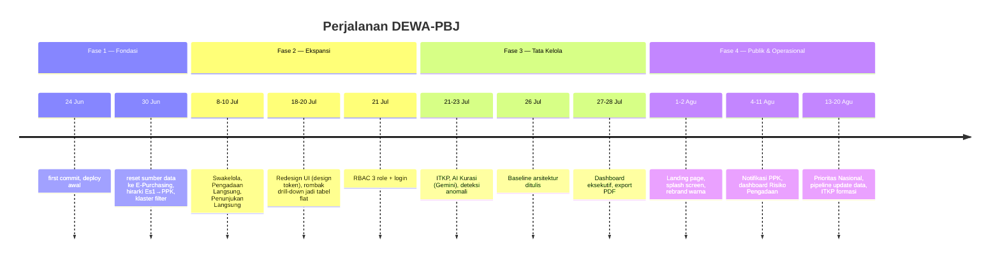

# Dokumentasi Pembangunan DEWA-PBJ — Perjalanan 4 Fase

**Disusun:** 24 Agustus 2026
**Cakupan:** `first commit` (24 Juni 2026) → kondisi terkini branch `rework-pengadaan` (20 Agustus 2026), 226 commit
**Sifat dokumen:** Ini bukan rencana yang ditulis di awal lalu diikuti apa adanya. Ini catatan perjalanan sungguhan — termasuk reset data di minggu pertama, dua kali rombak arsitektur tampilan modul realisasi, dan redesign total identitas visual di pertengahan jalan. Dokumen pendamping teknis yang lebih rinci: [BASELINE-ARSITEKTUR.md](BASELINE-ARSITEKTUR.md).

---

## Ringkasan Eksekutif

DEWA-PBJ ("Early warning pengadaan") lahir sebagai dashboard monitoring Pengadaan Barang/Jasa untuk UKPBJ Kementerian Ketenagakerjaan. Dari commit pertama sampai hari ini, aplikasi ini tidak dibangun lurus dari cetak biru ke produk jadi — ia tumbuh lewat siklus **coba → dapati data/asumsi salah → reset → bangun ulang lebih kuat**, berulang setidaknya empat kali dalam skala besar.

Perjalanan itu terbagi wajar menjadi empat fase, masing-masing ditutup oleh sebuah pergeseran nyata dalam apa yang sedang dikerjakan tim:

| Fase                                         | Periode         | Fokus                                                     | Penanda akhir fase                                         |
| -------------------------------------------- | --------------- | --------------------------------------------------------- | ---------------------------------------------------------- |
| **1. Fondasi & Realisasi Pertama**     | 24–30 Jun 2026 | Bootstrap Next.js, satu sumber data, satu modul realisasi | Klasterisasi filter Realisasi (Sudah/Proses/Belum) selesai |
| **2. Ekspansi Modul & Fondasi Akses**  | 2–21 Jul 2026  | 5 modul realisasi lengkap, redesign UI, RBAC              | Sistem login 3 role berjalan                               |
| **3. Tata Kelola & Kecerdasan Data**   | 21–31 Jul 2026 | ITKP, AI Kurasi, deteksi anomali, dashboard eksekutif     | Baseline arsitektur didokumentasikan                       |
| **4. Pengalaman Publik & Operasional** | 1–20 Agu 2026  | Landing page, manajemen risiko, notifikasi, pipeline data | Runbook update data & modul ITKP lanjutan                  |

| **No.** | **Nama Paket**                                                                                                        | **Jenis Pengadaan** | **Versi** | **Status**    | **Tanggal Buat** | **Satuan Kerja**                              |
| ------------- | --------------------------------------------------------------------------------------------------------------------------- | ------------------------- | --------------- | ------------------- | ---------------------- | --------------------------------------------------- |
| 1             | Langganan CapCut                                                                                                            | Pengadaan Langsung        | spse 4.5        | Draft               | 21 Agustus 2026        | Sekretariat Jenderal                                |
| 2             | Sewa Mesin Foto Copy (TU Biro Umum)                                                                                         | Pengadaan Langsung        | spse 4.5        | Draft               | 21 Agustus 2026        | Sekretariat Jenderal                                |
| 3             | [TU Menteri dan Wakil Menteri] Belanja Pemeliharaan Peralatan dan Mesin-Pengadaan BBM Kendaraan Dinas Ops. Kegiatan Menteri | Pengadaan Langsung        | spse 4.5        | Draft               | 21 Agustus 2026        | Sekretariat Jenderal                                |
| 4             | [TU Menteri dan Wakil Menteri] Belanja Pemeliharaan Peralatan dan Mesin-Pemeliharaan Komputer/Notebook                      | Pengadaan Langsung        | spse 4.5        | Draft               | 21 Agustus 2026        | Sekretariat Jenderal                                |
| 5             | [TU Menteri dan Wakil Menteri] Belanja Barang Persediaan Barang Konsumsi-Cetak Amplop Surat Menteri                         | Pengadaan Langsung        | spse 4.5        | Draft               | 21 Agustus 2026        | Sekretariat Jenderal                                |
| 6             | Belanja Pemerliharaan Peralatan Perkantoran - Notebook                                                                      | Pengadaan Langsung        | spse 4.5        | Draft               | 21 Agustus 2026        | Sekretariat Jenderal                                |
| 7             | [TU Menteri dan Wakil Menteri] Belanja Sewa-Sewa mesin fotocopy Digital                                                     | Pengadaan Langsung        | spse 4.5        | Draft               | 20 Agustus 2026        | Sekretariat Jenderal                                |
| 8             | Fumigasi Ruang Arsip                                                                                                        | Pengadaan Langsung        | spse 4.5        | Draft               | 20 Agustus 2026        | Sekretariat Jenderal                                |
| 9             | Fumigasi Ruang Arsip Kranji                                                                                                 | Pengadaan Langsung        | spse 4.5        | Draft               | 20 Agustus 2026        | Sekretariat Jenderal                                |
| 10            | Penyemprotan anti jamur ruang arsip walang                                                                                  | Pengadaan Langsung        | spse 4.5        | Draft               | 20 Agustus 2026        | Sekretariat Jenderal                                |
| 11            | Penyemprotan anti jamur ruang arsip gatsu 51                                                                                | Pengadaan Langsung        | spse 4.5        | Draft               | 20 Agustus 2026        | Sekretariat Jenderal                                |
| 12            | Pemeliharaan Komputer TU Biro Umum                                                                                          | Pengadaan Langsung        | spse 4.5        | Draft               | 20 Agustus 2026        | Sekretariat Jenderal                                |
| 13            | Belanja Pemerliharaan Peralatan Perkantoran - Printer                                                                       | Pengadaan Langsung        | spse 4.5        | Draft               | 20 Agustus 2026        | Sekretariat Jenderal                                |
| 14            | [TU Menteri dan Wakil Menteri] Belanja Sewa-sarana transport penunjang operasional Menteri                                  | Pengadaan Langsung        | spse 4.5        | Draft               | 20 Agustus 2026        | Sekretariat Jenderal                                |
| 15            | Perawatan Arsip Pusat Arsip Gatsu 51                                                                                        | Pengadaan Langsung        | spse 4.5        | Draft               | 20 Agustus 2026        | Sekretariat Jenderal                                |
| 16            | perawatan arsip pusat arsip walang                                                                                          | Pengadaan Langsung        | spse 4.5        | Draft               | 20 Agustus 2026        | Sekretariat Jenderal                                |
| 17            | Belanja Pemerliharaan Peralatan Perkantoran - PC                                                                            | Pengadaan Langsung        | spse 4.5        | Draft               | 20 Agustus 2026        | Sekretariat Jenderal                                |
| 18            | Anti Rayap Ruang Arsip Gatsu 51                                                                                             | Pengadaan Langsung        | spse 4.5        | Paket Sudah Selesai | 20 Agustus 2026        | Sekretariat Jenderal                                |
| 19            | Anti Rayap Ruang Arsip Walang                                                                                               | Pengadaan Langsung        | spse 4.5        | Paket Sudah Selesai | 20 Agustus 2026        | Sekretariat Jenderal                                |
| 20            | Anti Rayap Ruang Arsip Kranji                                                                                               | Pengadaan Langsung        | spse 4.5        | Paket Sudah Selesai | 20 Agustus 2026        | Sekretariat Jenderal                                |
| 21            | Langganan CapCut                                                                                                            | Pengadaan Langsung        | spse 4.5        | Draft               | 20 Agustus 2026        | Sekretariat Jenderal                                |
| 22            | Sarana Pendukung Kearsipan                                                                                                  | Pengadaan Langsung        | spse 4.5        | Draft               | 20 Agustus 2026        | Sekretariat Jenderal                                |
| 23            | Belanja Bahan (Konsumsi Rapat Bimtek SIKN-JIKN)                                                                             | Pengadaan Langsung        | spse 4.5        | Paket Sudah Selesai | 20 Agustus 2026        | Sekretariat Jenderal                                |
| 24            | (Persuratan dan Kearsipan ) Cetak Buku Permenaker Tata Naskah Dinas                                                         | Pengadaan Langsung        | spse 4.5        | Paket Sudah Selesai | 20 Agustus 2026        | Sekretariat Jenderal                                |
| 25            | Konsumsi rapat Pemilihan Arsiparis Teladan                                                                                  | Pengadaan Langsung        | spse 4.5        | Paket Sudah Selesai | 20 Agustus 2026        | Sekretariat Jenderal                                |
| 26            | [TU Menteri dan Wakil Menteri] Belanja Sewa-sarana transport penunjang operasional Wakil Menteri                            | Pengadaan Langsung        | spse 4.5        | Draft               | 19 Agustus 2026        | Sekretariat Jenderal                                |
| 27            | Konsumsi rapat Audit Kearsipan Internal dan Eksternal                                                                       | Pengadaan Langsung        | spse 4.5        | Paket Sudah Selesai | 19 Agustus 2026        | Sekretariat Jenderal                                |
| 28            | Belanja Sewa Kendaraan                                                                                                      | Pengadaan Langsung        | spse 4.5        | Draft               | 19 Agustus 2026        | Sekretariat Jenderal                                |
| 29            | Operasional PBJ - Langganan Canva PBJ                                                                                       | Pengecualian              | spse 4.5        | Paket Sudah Selesai | 13 Agustus 2026        | Sekretariat Jenderal                                |
| 30            | Operasional PBJ - Langganan Zoom Meeting                                                                                    | Pengecualian              | spse 4.5        | Paket Sudah Selesai | 13 Agustus 2026        | Sekretariat Jenderal                                |
| 31            | Operasional PBJ - Pemeliharaan Printer PBJ                                                                                  | Pengadaan Langsung        | spse 4.5        | Draft               | 11 Agustus 2026        | Sekretariat Jenderal                                |
| 32            | Operasional PBJ - Pemeliharaan personal komputer PBJ                                                                        | Pengadaan Langsung        | spse 4.5        | Draft               | 10 Agustus 2026        | Sekretariat Jenderal                                |
| 33            | Operasional PBJ - Biaya Kerumahtanggaan PBJ                                                                                 | Pengadaan Langsung        | spse 4.5        | Draft               | 10 Agustus 2026        | Sekretariat Jenderal                                |
| 34            | Operasional PBJ - Pengadaan Sarana Pendukung Pelayanan PBJ                                                                  | Pengadaan Langsung        | spse 4.5        | Draft               | 10 Agustus 2026        | Sekretariat Jenderal                                |
| 35            | Operasional PBJ - Pemeliharaan personal Laptop PBJ                                                                          | Pengadaan Langsung        | spse 4.5        | Draft               | 10 Agustus 2026        | Sekretariat Jenderal                                |
| 36            | [Protokol] Belanja Pemeliharaan Kendaraan Dinas                                                                             | Pengadaan Langsung        | spse 4.5        | Draft               | 17 Juni 2026           | Sekretariat Jenderal                                |
| 37            | Belanja Bahan                                                                                                               | Pengadaan Langsung        | spse 4.5        | Draft               | 4 Juli 2025            | Ditjen Pembinaan Pelatihan Vokasi dan Produktivitas |

---

## Fase 1 — Fondasi & Realisasi Pertama (24–30 Juni 2026)

### Yang terjadi

Proyek dimulai dengan cara paling wajar: `first commit`, lalu `first development`, lalu `initiation for deploy` — semuanya di tanggal 24 Juni, dalam satu hari. Ini menunjukkan aplikasi memang dirancang sejak awal untuk cepat sampai ke Vercel, bukan dikembangkan lama secara lokal dulu. Iterasi pertama juga langsung memangkas sesuatu yang dianggap tidak perlu: dropdown Satker di topbar dihapus di commit kelima.

Enam hari kemudian datang titik balik pertama proyek ini, dan ia bukan penambahan fitur — ia sebuah **reset**:

> `21bed97` — *"Reset karena pergantian data dari realisasi data.inaproc ke penggunaan data dari API dengan E-Purchasing"*

Sumber data awal (inaproc) ternyata tidak cocok dengan kebutuhan, dan tim memutuskan pindah ke data E-Purchasing tanpa menyeret asumsi lama. Dari reset ini, dalam sisa minggu yang sama, satu modul realisasi (E-Purchasing) dibangun dari nol sampai cukup matang:

- Fitur pencarian & filter, dengan aturan eksplisit **paket berstatus cancelled tidak pernah dimasukkan** ke perhitungan.
- Tampilan hirarki tiga tingkat: **Eselon I → PPK → detail paket** yang dipegang tiap PPK — pola navigasi yang nantinya jadi cetakan untuk modul lain sebelum akhirnya digantikan (lihat Fase 2).
- Filter lanjutan (advance filter) dan sorting.
- Perbaikan data yang cukup fundamental: **FULL OUTER JOIN** supaya paket dari sisi Terumumkan (RUP) dan sisi Realisasi sama-sama muncul, termasuk yang tidak saling tersambung — ini titik awal dari apa yang kelak jadi konsep `is_from_sirup` di seluruh sistem.
- Histori per card lewat CTE, penguncian nilai metrik supaya tidak berubah-ubah saat filter di-toggle, dan penjumlahan realisasi yang di-dedupe supaya tidak dobel-hitung.
- Penutup fase: **klasterisasi filter** menjadi tiga status yang jadi bahasa baku sepanjang proyek — **Sudah Realisasi, Proses, Belum Realisasi** — plus filter untuk menandai paket "abnormal" yang realisasinya melebihi pagu (cikal-bakal deteksi anomali di Fase 3).

### Kenapa ini penting

Fase ini menetapkan dua keputusan yang bertahan sampai hari ini: **realisasi harus selalu dibaca berdampingan dengan RUP** (bukan berdiri sendiri), dan **status paket punya taksonomi tetap** (Sudah/Proses/Belum). Hampir semua modul yang dibangun setelahnya adalah variasi dari pola yang lahir di sini.

---

## Fase 2 — Ekspansi Modul Realisasi & Fondasi Akses (2–21 Juli 2026)

### Yang terjadi

Setelah E-Purchasing stabil, fase ini adalah tentang **replikasi pola ke metode pengadaan lain**, sambil dua kali menyadari bahwa pola yang direplikasi perlu dirombak.

**Perluasan cakupan metode.** Setelah perbaikan filter E-Purchasing V6 (memastikan hanya paket bermetode itu yang masuk halamannya), fitur Swakelola menyusul di 8 Juli. Dua hari kemudian, Realisasi Pengadaan Langsung dibangun lengkap dengan drill-down hirarkis penuh — lalu dalam hari yang sama langsung diperkaya dengan penanganan realisasi ganda (pencatatan vs transaksional), metrik khusus, dan histori perubahan RUP di modal detail. Bug-bug data nyata muncul dan diperbaiki di jalan: satker dengan kode berawalan nol (mis. Bandung Barat) gagal ter-mapping ke Eselon I sampai ditemukan penyebabnya ada di pencocokan string yang tidak menghiraukan leading zero — perbaikan ini kemudian jadi konvensi wajib (`LTRIM(kode, '0')`) di seluruh join satker. Klaster "Multiple RUP" ditambahkan untuk menangani kenyataan bahwa satu realisasi bisa merujuk banyak `kd_rup` sekaligus (dipisah titik koma). Penunjukan Langsung, lalu penggabungan Dikecualikan ke dalamnya, melengkapi lima modul realisasi di pertengahan Juli.

**Rombak pertama: navigasi.** Pola hirarki drill-down dari Fase 1 diubah jadi vertical card di 10 Juli — percobaan menata ulang cara pengguna menavigasi Satker/PPK.

**Redesign identitas visual.** Di 17–18 Juli, proyek mendapat perombakan tampilan besar pertamanya: desain token, komponen UI baru, layout modern, lalu di hari berikutnya "Fase 2" dari redesign ini memperbaiki token yang rusak dan merapikan feature view secara bertarget — sinyal bahwa redesign besar-besaran pertama tidak sepenuhnya mulus dan butuh perbaikan susulan segera.

**Rombak kedua, dan lebih besar: arsitektur tampilan modul.** Pada 20 Juli, kelima modul realisasi **dirombak dari model drill-down ke tabel flat dengan filter** — pembalikan arah dari pola navigasi hirarkis yang dibangun sejak Fase 1. Ini keputusan penting: drill-down bertingkat (Es1 → Satker → PPK → paket) ternyata tidak seramah tabel datar dengan filter cepat untuk kebutuhan monitoring harian. Sehari setelahnya menyusul kebutuhan agar filter Eselon I/Satker/PPK bisa dicari (searchable), karena daftarnya sudah cukup panjang untuk butuh pencarian, bukan sekadar dropdown.

**Fondasi akses.** Fase ini ditutup dengan pergeseran dari "aplikasi terbuka" ke "aplikasi bergerbang": **sistem RBAC 3 role (admin, sekjend, ppk) dengan login Supabase Auth**, lengkap dengan halaman login yang langsung didesain ulang dengan animasi di hari yang sama, dan perbaikan cepat menyusul agar PPK tetap bisa melihat semua fitur Realisasi namun datanya di-scope ke satker/PPK miliknya sendiri saja.

### Kenapa ini penting

Fase ini adalah fase paling "berisik" dalam siklus coba-perbaiki: dua rombak arsitektur tampilan dalam tiga minggu bukan tanda proyek berantakan, melainkan tanda tim menguji pola nyata dengan pengguna/data sungguhan dan berani membalik arah begitu polanya terbukti tidak pas. Sistem akses yang lahir di ujung fase ini menjadi gerbang yang membentuk seluruh desain fase-fase berikutnya (query di-scope per role, sidebar terfilter per role, dan seterusnya).

---

## Fase 3 — Tata Kelola & Kecerdasan Data (21–31 Juli 2026)

### Yang terjadi

Dengan lima modul realisasi dan akses berbasis role sudah berdiri, fase ini menambahkan **lapisan yang menilai dan mengawasi**, bukan sekadar menampilkan data mentah.

**ITKP — Indeks Tata Kelola Pengadaan.** Dashboard penilaian ITKP dibangun 21 Juli dengan Indikator A (Pemanfaatan Sistem) dihitung dari data nyata, sedang Komponen B/C/D masih dummy sementara — keputusan sadar untuk merilis dengan sebagian nilai placeholder daripada menunda seluruh modul. Sepanjang minggu berikutnya modul ini terus disempurnakan: halaman detail per satker/Eselon I, tabel seluruh satker, dan penyederhanaan dashboard agar tidak terlalu padat.

**AI Kurasi.** Fitur validasi otomatis — apakah metode pemilihan sebuah paket sudah sesuai pagu dan jenis pengadaan — dibangun dengan model Gemini, disimpan terpisah ke tabel `ai_kurasi_paket`, dan dirancang sebagai proses loop otomatis (ambil batch → kirim ke AI → simpan → ulangi) karena volume paket yang perlu dikurasi mencapai puluhan ribu. Fitur ini tidak langsung akurat: laporan analisis 23 Juli mencatat bahwa kualitas kurasi awalnya lemah karena data pendukung (jenis pengadaan) tidak ikut dikirim ke AI, dan prompt sempat membuat AI "berhalusinasi" menilai data yang sebenarnya tidak tersedia. Perbaikan berturut-turut: kirim `jenis_pengadaan`, rapikan prompt, ikutkan swakelola yang sebelumnya selalu "Belum Dikurasi", kecilkan ukuran batch dari 100 ke 40 supaya respons JSON tidak terpotong, dan tangani rate-limit Gemini secara eksplisit (HTTP 429 + retry-after) supaya loop menunggu dengan sopan, bukan berhenti kasar.

**Deteksi anomali** dirumuskan sebagai dua aturan murni dan konsisten di seluruh modul: *realisasi tanpa RUP* (paket punya realisasi tapi tidak pernah terumumkan di SIRUP) dan *realisasi melebihi pagu* — keduanya turunan langsung dari keputusan `is_from_sirup` yang mulai dirintis sejak Fase 1.

**Dashboard eksekutif.** Panel analitik dan scorecard eksekutif ditambahkan, lalu Ringkasan (halaman utama) di-redesign total agar seluruh angkanya berbasis data nyata alih-alih ringkasan statis — termasuk chart Cara Pengadaan, grafik distribusi metode, dan (menutup fase ini) fitur ekspor snapshot PDF untuk laporan Ringkasan.

**Redesign kedua.** Sidebar dan topbar dirombak lagi ke gaya modern-minimalis (22 Juli), berbeda dari redesign token warna di Fase 2 — kali ini menyasar struktur navigasi itu sendiri, bukan hanya tampilan permukaan.

**Titik jeda untuk mendokumentasikan.** Pada 26 Juli, setelah tiga minggu pertumbuhan cepat dan dua kali reset arsitektural, tim berhenti sejenak dan menulis [BASELINE-ARSITEKTUR.md](BASELINE-ARSITEKTUR.md) — dokumen rujukan tunggal tentang apa yang sudah ada, konvensi yang harus diikuti, dan utang teknis yang diketahui. Ini penanda kedewasaan proyek: dari "membangun secepat mungkin" menjadi "membangun sambil menjaga agar bisa dipahami orang lain (atau diri sendiri di masa depan)".

### Kenapa ini penting

Fase ini mengubah DEWA-PBJ dari *pencatat* menjadi *penilai*: aplikasi mulai punya pendapat sendiri tentang data (akurat/tidak akurat, wajar/anomali, baik/perlu perhatian) alih-alih sekadar menyajikan angka mentah. Ini juga fase paling jujur soal keterbatasan — ITKP B/C/D dummy dan AI Kurasi yang awalnya salah keduanya dirilis lebih dulu lalu diperbaiki secara terbuka, bukan ditunda sampai sempurna.

---

## Fase 4 — Pengalaman Publik & Operasional Berkelanjutan (1–20 Agustus 2026)

### Yang terjadi

Dengan fondasi data dan tata kelola sudah kokoh, fase ini mengarahkan energi ke dua arah sekaligus: **wajah publik aplikasi** dan **keberlangsungan operasionalnya**.

**Landing page & identitas.** Sebelumnya aplikasi langsung membuka dashboard (`/ringkasan` dipindah dari akar `/`); di akhir Juli sebuah landing page ditambahkan sebagai pintu masuk, lengkap dengan header floating island dan animasi transisi ke halaman login. Awal Agustus, brand color diganti dari teal ke `#13416B` (navy institusional), splash screen bermerek ditambahkan, dan identitas Kemnaker/UKPBJ ditegaskan di hero serta halaman login — pergeseran dari "aplikasi internal fungsional" ke "produk dengan identitas institusional yang disengaja". Halaman "Tentang" yang sempat ada justru dicabut lagi beberapa hari kemudian, dan begitu pula halaman PPK view — tanda tim tidak segan memangkas fitur yang sudah dibangun begitu terbukti tidak diperlukan.

**Manajemen risiko.** Dashboard Risiko Pengadaan dibangun dan diiterasi cukup intensif dalam waktu singkat: dari bar chart log-scale, ke 100% stacked bar chart, sampai jadi versi interaktif yang bisa difilter dengan klik langsung pada chart-nya, lalu dirombak ulang menjadi komponen "Sebaran Risiko" 30/70. Ada juga perbaikan data penting: baris data yatim (orphan) dibersihkan dan RUP hasil revisi dikecualikan dari perhitungan risiko, plus penambalan kebocoran keamanan di mana identitas paket satker lain sempat bisa terlihat lewat panel Risiko di Ringkasan — diperbaiki cepat begitu ditemukan.

**Notifikasi untuk PPK.** Sebuah lonceng notifikasi ditambahkan di topbar, disusul halaman notifikasi khusus PPK yang sumber alert-nya diperluas, kemampuan membuka detail paket langsung dari notifikasi tanpa meninggalkan halaman (dibuka di modal), dan akhirnya PPK bisa mengajukan klarifikasi langsung dari panel detail — mengubah notifikasi dari sekadar pemberitahuan pasif menjadi kanal komunikasi dua arah.

**Insight tambahan.** Peringkat/ranking satuan kerja ditambahkan ke Ringkasan (berdasarkan realisasi, sempat diberi label "RUP" lalu dikoreksi menjadi "SPSE" agar sesuai sumber data sebenarnya), lengkap dengan modal detail dan opsi cetak ke PDF. Kartu KPI dirombak jadi komponen baru, dan drill-down dari Ringkasan langsung ke daftar paket ditambahkan supaya angka ringkasan tidak jadi jalan buntu.

**Cakupan data baru.** Halaman Program Prioritas Nasional (realisasi paket PN) ditambahkan pertengahan Agustus, dan modul ITKP diperluas dengan JF Perpindahan serta modal "Rincian Keterisian Formasi" — memperluas apa yang diukur ITKP di luar sekadar pemanfaatan sistem.

**Operasional jangka panjang.** Penanda paling penting di fase ini bukan fitur yang terlihat pengguna: 18 Agustus, sebuah **mekanisme resmi untuk menyegarkan data Supabase** dibangun (`scripts/update_from_data_update.mjs`) beserta [runbook](RUNBOOK-UPDATE-DATA.md) lengkapnya, dan dituliskan sebagai aturan wajib di `AGENTS.md`: *jangan pernah menulis script import baru, gunakan mekanisme yang sudah ada, selalu `--dry-run` dulu*. Ini menutup lubang yang selama ini ada — sebelumnya pembaruan data terasa ad-hoc (banyak skrip diagnostik satu-pakai di `scripts/`), sekarang ada satu jalur baku yang bisa diulang oleh siapa pun (termasuk asisten AI) tanpa risiko merusak data produksi.

### Kenapa ini penting

Fase ini menandai transisi dari "membangun fitur" ke "menjaga produk yang sudah hidup". Landing page dan rebrand adalah tentang bagaimana aplikasi ini diperkenalkan ke orang baru; notifikasi PPK adalah tentang menjadikannya alat kerja harian, bukan hanya dashboard yang dibuka sesekali; dan runbook update data adalah tentang memastikan aplikasi bisa terus dipercaya datanya tanpa developer aslinya harus selalu hadir.

---

## Ke Mana Arah Selanjutnya

Empat fase di atas menjelaskan *bagaimana* DEWA-PBJ sampai ke bentuknya hari ini, tapi baseline arsitektur (§11–13 di [BASELINE-ARSITEKTUR.md](BASELINE-ARSITEKTUR.md)) sudah memetakan dengan jujur apa yang belum selesai — di antaranya yang paling berdampak:

- **Keamanan:** endpoint `/api/kurasi` masih tanpa autentikasi, dan scoping data PPK saat ini murni di layer aplikasi (anon key Supabase bisa membaca semua view langsung dari browser).
- **Kebenaran data:** beberapa tabel sumber (`api_paket_penyedia_terumumkan`, `pencatatan_non_tender_realisasi`) belum punya DDL resmi; aturan gating `is_from_sirup` belum seragam di semua modul realisasi.
- **Kelengkapan fitur:** ITKP Komponen B/C/D masih nilai dummy tetap, menunggu tabel sumber data sungguhan.
- **Kebersihan kode:** duplikasi ±80% antar lima modul realisasi belum diringkas mengikuti pola bersih yang sudah ada di `ringkasanData.ts`; belum ada test maupun CI sama sekali.

Pola yang konsisten di sepanjang empat fase ini — berani reset ketika asumsi terbukti salah, merilis versi "cukup baik" lalu memperbaikinya secara terbuka, dan berhenti sejenak untuk mendokumentasikan begitu kompleksitas mulai sulit dipegang di kepala satu orang — kemungkinan besar adalah cara proyek ini akan terus berkembang ke depan.
