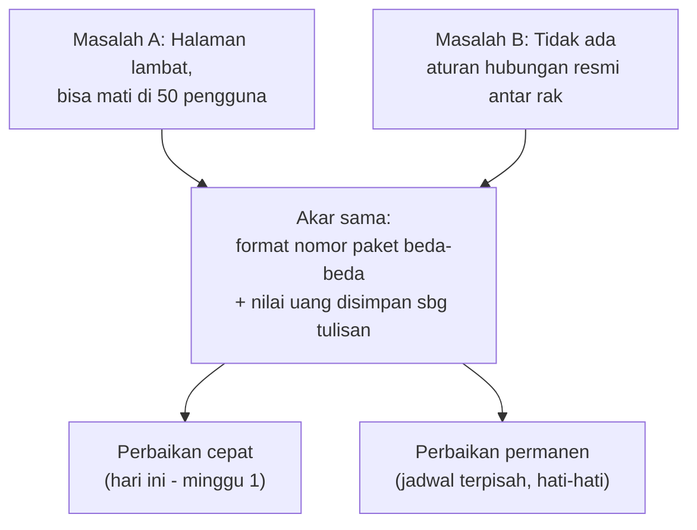

# Peta Prioritas — Database Dewa-PBJ

Ini gabungan dua temuan yang tadinya terpisah:

1. **[`LAPORAN-ANALISIS-PERFORMA.md`](./LAPORAN-ANALISIS-PERFORMA.md)** — kenapa halaman Ringkasan lambat dan bisa mati kalau dibuka 50 orang bersamaan.
2. **[`RANCANGAN-RELASI-DATABASE.md`](./RANCANGAN-RELASI-DATABASE.md)** — kenapa tabel-tabel di database tidak "terdaftar resmi" saling terhubung.

Ternyata dua masalah ini **ketemu di satu titik yang sama**: format nomor paket (`kd_rup`) yang berbeda-beda di tiap tabel. Jadi dokumen ini menggabungkan keduanya jadi **satu peta jalan**, bukan dua daftar kerja yang terpisah.

Bahasa yang dipakai sama seperti laporan performa sebelumnya, supaya bisa langsung dibaca tanpa latar belakang teknis:

| Istilah | Artinya |
|---|---|
| Gudang | Database |
| Rak | Tabel |
| Daftar isi | Index (biar petugas tidak perlu buka semua rak) |
| Aturan hubungan resmi | Foreign key / relasi antar tabel |
| Rekap tersimpan | Materialized view (hasil hitungan yang disimpan, tidak dihitung ulang tiap kali) |
| Fotokopi rekap | Cache |

---

## Dua masalah, satu akar

**Kenapa satu akar?** Supaya dua rak bisa "resmi terhubung" (relasi/FK), nomor paketnya harus **sama formatnya** di kedua sisi. Dan supaya "daftar isi" (index) bisa dipakai untuk mempercepat pencarian, pencariannya juga harus **sama formatnya**, tidak boleh diterjemahkan dulu di tengah jalan. Membenahi format nomor paket sekali jalan menyelesaikan separuh dari kedua masalah.

---

## Peta prioritas gabungan

Empat fase, diurutkan dari yang **paling murah & aman** ke yang **paling permanen & berisiko**.

### 🟢 Fase 0 — Hari ini, murah, nyaris tanpa risiko

Ini pekerjaan kecil yang bisa langsung dikerjakan tanpa menunggu apa pun.

| Pekerjaan | Untuk apa | Waktu | Sumber |
|---|---|---|---|
| Betulkan urutan pengambilan data bertahap | Cegah **angka salah** ikut terbawa ke laporan resmi | ½ hari | Laporan performa, Langkah 6 |
| Saring data per tahun anggaran | Cegah halaman makin lambat tiap tahun anggaran baru | 2 jam | Laporan performa, Langkah 2 |
| Pasang 3 relasi yang sudah aman: `ai_kurasi_paket`, `satker_kode_alias`, `pencatatan_swakelola_realisasi` | Mulai menjaga integritas data tanpa menyentuh apa pun yang berisiko | ½ hari | Rancangan relasi, Tier 1 |

**Kenapa digabung jadi satu fase:** semuanya murah, semuanya rendah risiko, dan tidak ada yang saling menunggu. Bisa dikerjakan sekaligus di hari yang sama.

---

### 🔵 Fase 1 — Minggu 1, dampak kecepatan paling besar

Ini yang **menjawab langsung** pertanyaan "kenapa lambat / kenapa timeout di banyak pengguna". Tidak menyentuh soal relasi sama sekali — murni soal cara data diambil.

| Pekerjaan | Hasil | Waktu | Sumber |
|---|---|---|---|
| 1. Buat "rekap tersimpan" dari data paket | 1,3 detik → 0,015 detik per permintaan | 1 hari | Laporan performa, Langkah 1 |
| 2. Halaman ambil angka jadi, bukan mentah | 26 kali bolak-balik → 1 kali | 1 hari | Laporan performa, Langkah 3 |
| 3. "Fotokopi" rekap untuk banyak pengguna | 50 pengguna = seringan 1 pengguna | ½ hari | Laporan performa, Langkah 4 |
| 4. Rekap terpisah untuk data risiko | 15 MB → ± 3 KB (ini **79% dari seluruh beban halaman**, cuma untuk 2 grafik) | ½ hari | Laporan performa, Langkah 5 |

> **Setelah Fase 1 selesai (± 3 hari kerja): pertanyaan "kuat tidak 50 pengguna bersamaan" sudah terjawab tuntas.** Tidak perlu menunggu Fase 2.

---

### 🟠 Fase 2 — Terjadwal terpisah, risiko tinggi, tapi PERMANEN

Ini titik temu kedua laporan — **satu pekerjaan yang sama**, disebut dua istilah berbeda di masing-masing dokumen:

> Laporan performa menyebutnya **"Langkah 8: rapikan format nomor paket & nilai uang"**.
> Rancangan relasi menyebutnya **"Tier 0: prasyarat sebelum relasi apa pun bisa dibuat"**.
> **Keduanya persis pekerjaan yang sama.**

| Pekerjaan | Kenapa penting | Waktu | Risiko |
|---|---|---|---|
| Seragamkan format nomor paket di semua rak (satu tipe, bukan campur angka/tulisan) | Tanpa ini: daftar isi (index) gampang rusak lagi kalau ada yang mengubah kode sedikit saja — **sudah pernah bikin sistem mati sebelumnya** | 2–3 hari | Tinggi |
| Ubah nilai uang dari tulisan jadi angka betulan | Tanpa ini: **satu file impor yang formatnya sedikit beda bisa mematikan seluruh dashboard Kementerian** | 1–2 hari | Tinggi |
| Tambahkan aturan hubungan resmi (relasi) di atas format yang sudah rapi | Baru di titik **ini** relasi Tier 2 (rantai revisi RUP, kode satker, dll di Rancangan Relasi) bisa dipasang dengan aman | mengikuti | Sedang, setelah dua di atas beres |

**Kenapa ditaruh terakhir walau dampaknya paling besar dan paling permanen:** risikonya tinggi (menyentuh struktur data inti), jadi butuh waktu tenang, cadangan data, dan pengerjaan bertahap satu rak per kali — bukan sambil terburu-buru menutup keluhan "lambat".

---

### ⚪ Fase 3 — Opsional / situasional

Tidak mendesak, bisa disisipkan kapan saja tanpa menunggu fase lain.

| Pekerjaan | Catatan | Sumber |
|---|---|---|
| Tunda muat program Export/Cetak sampai tombolnya ditekan | Berdiri sendiri, bisa dikerjakan kapan saja | Laporan performa, Langkah 7 |
| Biarkan 5 relasi Tier 3 tetap longgar (bukan aturan ketat) | **Sengaja tidak dikerjakan** — ini transaksi yang secara sah kadang tidak punya pasangan RUP; aturan ketat justru akan menolak data yang benar | Rancangan relasi, Tier 3 |

---

## Satu tabel untuk semua

| Fase | Pekerjaan | Untuk kecepatan? | Untuk kerapian data? | Waktu | Risiko |
|:---:|---|:---:|:---:|:---:|:---:|
| 🟢 0 | Betulkan urutan pengambilan bertahap | – | ✅ | ½ hari | Sangat rendah |
| 🟢 0 | Saring per tahun anggaran | ✅ | – | 2 jam | Rendah |
| 🟢 0 | Pasang 3 relasi aman (Tier 1) | – | ✅ | ½ hari | Rendah |
| 🔵 1 | Rekap tersimpan | ✅✅✅ | – | 1 hari | Rendah |
| 🔵 1 | Halaman ambil angka jadi | ✅✅✅ | – | 1 hari | Sedang |
| 🔵 1 | Fotokopi rekap (cache) | ✅✅✅ | – | ½ hari | Sedang |
| 🔵 1 | Rekap terpisah data risiko | ✅✅ | – | ½ hari | Rendah |
| 🟠 2 | Seragamkan format nomor paket | ✅ | ✅✅✅ | 2–3 hari | Tinggi |
| 🟠 2 | Ubah nilai uang jadi angka | ✅ | – | 1–2 hari | Tinggi |
| 🟠 2 | Pasang relasi Tier 2 (butuh di atas beres dulu) | – | ✅✅ | mengikuti | Sedang |
| ⚪ 3 | Tunda muat Export/Cetak | ✅ | – | ½ hari | Rendah |
| ⚪ 3 | Biarkan Tier 3 tetap longgar | – | (sengaja tidak) | – | – |

---

## Kalau waktu terbatas

| Sanggup berapa lama | Kerjakan | Hasilnya |
|---|---|---|
| **Setengah hari saja** | Fase 0, item pertama | Angka di laporan resmi tidak lagi berisiko keliru diam-diam |
| **1 hari** | Fase 1, item "Rekap tersimpan" saja | Beban database turun drastis; 50 pengguna kemungkinan besar sudah tertangani |
| **3 hari** | Seluruh Fase 0 + Fase 1 | "Kuat tidak 50 pengguna" **selesai tuntas**, plus mulai rapi soal relasi |
| **7–10 hari** | Fase 0 + 1 + 2 | Cepat **dan** rapi secara permanen — tidak ada lagi tambalan rapuh |

---

## Yang penting diingat

- **Fase 1 (kecepatan) dan Fase 2 (relasi/kerapian) adalah dua masalah yang beda tujuannya**, meski satu prasyaratnya sama. Mengerjakan Fase 1 saja **tidak** membuat data lebih rapi/terjaga. Mengerjakan relasi saja (Rancangan Relasi Tier 1) **tidak** membuat halaman lebih cepat.
- Kalau targetnya cuma "jangan sampai mati di 50 pengguna" → cukup **Fase 0 + Fase 1**, berhenti di situ dulu.
- Kalau targetnya "supaya pengembang berikutnya tidak bisa tidak sengaja mematikan sistem lagi" → itu **Fase 2**, dan itu pekerjaan yang lebih besar, harus direncanakan terpisah dengan waktu tenang.

---

*Digabungkan dari [`LAPORAN-ANALISIS-PERFORMA.md`](./LAPORAN-ANALISIS-PERFORMA.md) dan [`RANCANGAN-RELASI-DATABASE.md`](./RANCANGAN-RELASI-DATABASE.md). Rujuk kedua dokumen asli untuk detail teknis lengkap per item.*
