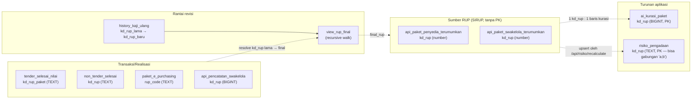

# Rancangan Relasi Database — Dewa-PBJ

Saat ini **tidak ada satu pun foreign key** di antara 21 tabel data (dikonfirmasi: setiap `Relationships: []` di `database.types.ts`, dan hanya satu `REFERENCES` di seluruh `sql/migrations/*.sql` — itu pun `profiles.id → auth.users.id`, plumbing login, bukan relasi bisnis).

Dokumen ini memetakan **semua relasi yang secara logis sudah dipakai** (lewat `JOIN` di view atau pencocokan manual di kode aplikasi) dan menilai masing-masing: **amankah dijadikan foreign key sungguhan sekarang?** Dasarnya bukan tebakan — setiap baris di bawah ditelusuri langsung dari `CREATE TABLE`/`CREATE VIEW` di `sql/migrations/` dan tipe kolom aktual di `database.types.ts`.

> **Cara pakai:** kolom "Tipe" di tiap tabel adalah yang tercatat di skema saat ini. Cocokkan dengan yang Anda lihat di Supabase Table Editor — kalau ada yang beda (skema mungkin berubah sejak `database.types.ts` terakhir di-generate 10 Agu), anggap dokumen ini sebagai starting point, bukan kebenaran mutlak.

---

## Ringkasan

| | |
|---|---|
| Relasi logis ditemukan | 19 |
| Aman dibuat FK sekarang | 3 |
| Butuh pembersihan data dulu | 11 |
| Tidak disarankan jadi FK ketat | 5 |
| Prasyarat struktural yang menghalangi semua di atas | 4 |

**Temuan paling penting:** dua tabel paling sentral di seluruh sistem — `api_paket_penyedia_terumumkan` dan `api_paket_swakelola_terumumkan` (sumber RUP dari SIRUP) — **tidak punya primary key sama sekali**. Keduanya lahir dari import CSV manual via Supabase Table Editor (lihat `25_IMPORT_DATA_CSV.sql`), bukan `CREATE TABLE` eksplisit. Tidak ada FK yang bisa menunjuk ke `kd_rup` di kedua tabel ini sampai itu dibereskan — ini prasyarat #1.

---

## Rantai identitas RUP (konsep inti)

Begini cara semua tabel *sebenarnya* nyambung hari ini — lewat `view_rup_final`, bukan FK:

Garis putus-putus = pencocokan nilai di `WHERE`/`JOIN`, **bukan** constraint database. Setiap titik potong di diagram ini adalah kandidat FK — tapi seperti terlihat di tabel di bawah, hampir semuanya butuh kerja dulu.

---

## Tier 0 — Prasyarat struktural

Tidak ada FK di bawah yang bisa dibuat sebelum ini beres:

| # | Masalah | Kenapa menghalangi |
|---|---|---|
| 0.1 | `api_paket_penyedia_terumumkan` **tanpa PK/UNIQUE** apa pun | FK butuh kolom target yang UNIQUE. Tabel ini lahir dari CSV import (`25_IMPORT_DATA_CSV.sql`), skema di-infer Supabase, tidak ada constraint. |
| 0.2 | `api_paket_swakelola_terumumkan` **tanpa PK/UNIQUE** apa pun | Sama seperti di atas. |
| 0.3 | Tipe `kd_rup` tidak seragam — campur `number`/`BIGINT` dan `TEXT` di 20+ kolom lintas tabel | FK mensyaratkan tipe kolom identik (atau cast eksplisit + index). Tabel CSV-import (non_tender_selesai, pencatatan_swakelola_realisasi, dll) menyimpan **semua** kolom sebagai TEXT by design (lihat komentar di `12_table_non_tender_selesai.sql`), termasuk yang secara logis numerik. |
| 0.4 | `master_data` PK = `"NO"` (nomor baris arbitrary), bukan `"KODE SATKER_str"` (kunci bisnis sebenarnya) — dan `"KODE SATKER_str"` sendiri punya inkonsistensi leading-zero (`021212` vs `21212`) | Kunci satker yang benar-benar dipakai di seluruh sistem (`"KODE SATKER_str"`) belum UNIQUE, dan nilainya sendiri butuh normalisasi (`LTRIM(..., '0')`) sebelum bisa jadi target FK yang match 1:1. |

---

## Tier 1 — Aman diterapkan sekarang

Relasi ini secara data sudah bersih (atau nyaris bersih); begitu prasyarat Tier 0 relevan beres, FK bisa langsung dipasang.

| Relasi | Tipe sumber | Tipe target | Catatan |
|---|---|---|---|
| `ai_kurasi_paket.kd_rup` → *(RUP master)* | `BIGINT` (PK di ai_kurasi_paket) | `number` (belum unique — perlu 0.1/0.2) | Sudah 1:1 secara desain (`ai_kurasi_paket.kd_rup BIGINT PRIMARY KEY`), tabel ini sendiri kecil & terkontrol (diisi oleh fitur AI Kurasi aplikasi, bukan import massal). |
| `satker_kode_alias.kode_master` → `master_data."KODE SATKER_str"` | `TEXT` | `TEXT` (perlu 0.4) | Tabel crosswalk kecil, dikurasi manual (2 baris saat ini, lihat `17_table_satker_kode_alias.sql`) — risiko rendah. |
| `pencatatan_swakelola_realisasi.kd_swakelola_pct` → `api_pencatatan_swakelola.kd_swakelola_pct` | `string`/TEXT | `BIGINT` (sudah PK) | Target **sudah** UNIQUE — cuma butuh `CAST(... AS BIGINT)` di sisi sumber. Tidak butuh Tier 0. Kandidat FK pertama yang paling gampang dibuat. |

---

## Tier 2 — Butuh pembersihan/normalisasi dulu

Relasinya nyata dan sudah dipakai di banyak view — tapi ada isu data konkret yang harus dibereskan dulu, atau constraint-nya harus lebih longgar dari FK biasa.

| Relasi | Isu |
|---|---|
| `history_kaji_ulang.kd_rup_lama` / `kd_rup_baru` → RUP master | Chain revisi bisa berlapis (`view_rup_final` pakai **recursive CTE** justru karena satu RUP bisa direvisi berkali-kali). FK naif ke satu tabel gagal — targetnya beda-beda tergantung `jenis_paket` (Penyedia/Swakelola), dan `kd_rup_lama` sendiri belum tentu unique per baris. |
| `tender_selesai_nilai.kd_rup_paket` → RUP master | Baris realisasi sering masih memakai **kd_rup LAMA** (sebelum revisi) — makanya `40_views_realisasi_tender_pl_pnl.sql` harus resolve lewat `view_rup_final` dulu. FK langsung akan menolak baris valid yang kd_rup-nya belum "final". |
| `non_tender_selesai.kd_rup` → RUP master | Isu sama persis dengan di atas (dipakai PL & PnL). |
| `pencatatan_non_tender_realisasi.kd_rup_paket` → RUP master | Isu sama. |
| `paket_e_purchasing.rup_code` → RUP master | Isu sama, plus: 44 paket diketahui E-Purchasing-only tanpa RUP sama sekali (butuh crosswalk `satker_kode_alias`, bukan match RUP). |
| `api_pencatatan_swakelola.kd_rup` → `api_paket_swakelola_terumumkan.kd_rup` | Butuh 0.2 (target belum unique) + tipe `kd_rup` di api_pencatatan_swakelola adalah `BIGINT` vs target `number` — perlu diverifikasi presisi sama. |
| `paket_anggaran_penyedia.kd_rup` → `api_paket_penyedia_terumumkan.kd_rup` | Butuh 0.1. Juga: satu `kd_rup` bisa muncul di **banyak baris** anggaran (multi tahun/sumber dana) — relasinya many-to-one, bukan 1:1, itu wajar untuk FK biasa tapi pastikan arah FK-nya benar (anggaran → RUP, bukan sebaliknya). |
| `paket_anggaran_swakelola.kd_rup` → `api_paket_swakelola_terumumkan.kd_rup` | Sama seperti di atas, plus tabel ini **tidak punya PK sama sekali** (cek `14_tables_anggaran_dan_tender.sql` — tidak ada `PRIMARY KEY` dideklarasikan, beda dari `paket_anggaran_penyedia` yang punya `id_paket_anggaran_penyedia`). |
| `*.kd_satker_str` (6+ tabel: `non_tender_selesai`, `tender_selesai_nilai`, `paket_anggaran_penyedia/swakelola`, `api_pencatatan_swakelola`, `history_kaji_ulang`) → `master_data."KODE SATKER_str"` | Leading-zero mismatch terdokumentasi (`31_view_rup_final.sql` baris 1-27) — 6 Balai Vokasi diketahui gagal match karena ini. Perlu normalisasi nilai (bukan cuma index `61_index_ltrim_satker.sql`) sebelum FK exact-match aman. |
| `paket_e_purchasing.kode_satker` → `master_data."KODE SATKER_str"` | Sama isu leading-zero, **plus** sebagian kode di E-Purchasing tidak match master sama sekali dan butuh `satker_kode_alias` sebagai lapis kedua (lihat `44_view_epurchasing_final.sql`) — relasi dua-lapis, FK tunggal tidak cukup mendeskripsikannya. |

---

## Tier 3 — Tidak disarankan sebagai FK ketat

Ini relasi yang **secara sengaja** longgar — memaksanya jadi FK `NOT NULL`/strict akan menolak data yang sekarang sah.

| Relasi | Kenapa harus tetap longgar |
|---|---|
| `risiko_pengadaan.kd_rup` → RUP master | Nilainya **bisa berupa string gabungan** `"a;b"` untuk paket dengan beberapa RUP dalam satu transaksi (komentar eksplisit di `64_table_risiko_pengadaan.sql`). Nilai komposit begini tidak bisa dijadikan FK ke satu baris RUP — secara desain tidak 1:1. |
| Baris "anomali" di semua view transaksi (`is_from_sirup = false`) | Ini **skenario bisnis yang sah**: realisasi/transaksi tercatat tanpa RUP terumumkan (mis. E-Purchasing di luar sistem, PL yang di-*exclude*). FK `NOT NULL` ke RUP master akan menolak baris-baris valid ini. |
| `api_paket_penyedia_terumumkan.nama_ppk` → `master_data."KODE PPK"` | Nama kolom **menyesatkan** — isinya kode PPK, bukan nama. Tapi bukan cuma soal nama: JOIN ini sendiri **tidak selalu match** (lihat `CASE WHEN p.nama_ppk = m."KODE PPK" THEN ... END` di `30_view_base_master_data.sql` — kalau tidak match, kolom master jatuh ke NULL, bukan error). Ada baris yang secara sah tidak match. |
| `profiles.satker` → `master_data."SATKER"` / `"SATUAN KERJA"` | Pencocokan **nama bebas** (text), bukan kode — rawan putus diam-diam kalau ada typo atau variasi penulisan nama satker. Kalau mau relasi ketat di sini, ubah dulu `profiles.satker` untuk menyimpan **kode** satker, bukan nama, baru FK masuk akal. |
| `profiles.ppk_name` → `master_data."NAMA PPK"` | Isu sama seperti di atas. |

---

## Cek tipe data — checklist untuk Anda verifikasi di Supabase

Ini semua kolom `kd_rup` yang saya temukan, dengan tipe yang tercatat di `database.types.ts` per tabel. Silakan cocokkan langsung ke Table Editor:

| Tabel | Tipe `kd_rup` tercatat |
|---|---|
| `api_paket_penyedia_terumumkan` | `number` |
| `api_paket_swakelola_terumumkan` | `number` |
| `api_pencatatan_swakelola` | `number \| null` |
| `paket_anggaran_penyedia` | `number \| null` |
| `paket_anggaran_swakelola` | `number \| null` |
| `ai_kurasi_paket` | `number` (PK) |
| `risiko_pengadaan` | `string` (PK, **bisa komposit**) |
| `master_data_ro` | `string \| null` |
| `view_dashboard_gabungan_satker` | `string \| null` |
| `view_dashboard_pengadaan_langsung` | `string \| null` |
| `view_dashboard_penunjukan_langsung` | `string \| null` |
| `view_dashboard_epurchasing_v6` | `number \| null` |
| `view_dashboard_swakelola_v1` | `number \| null` |
| `view_paket_penyedia_master_data` | `number \| null` |
| `view_paket_swakelola_master_data` | `number \| null` |
| `history_kaji_ulang.kd_rup_lama` / `kd_rup_baru` | `number \| null` (BIGINT) |
| `tender_selesai_nilai.kd_rup_paket` | *(TEXT — tabel ini didesain TEXT-first, lihat `14_tables_anggaran_dan_tender.sql`)* |
| `non_tender_selesai.kd_rup` | *(TEXT — seluruh tabel sengaja TEXT, lihat komentar di `12_table_non_tender_selesai.sql`)* |
| `paket_e_purchasing.rup_code` | *(TEXT)* |

**Pola yang konsisten:** tabel yang dibuat lewat `CREATE TABLE` eksplisit dengan tipe dipikirkan (`ai_kurasi_paket`, `history_kaji_ulang`, `risiko_pengadaan`) punya tipe `kd_rup` yang jelas. Tabel yang lahir dari **import CSV** (baik via wizard Supabase atau didesain TEXT-first untuk menghindari error import) hampir semua menyimpan `kd_rup` sebagai TEXT — bahkan ketika nilainya selalu angka. Ini pola yang sama di kolom `kd_satker` / `kd_satker_str` juga.

---

## Rekomendasi urutan pengerjaan

1. **Tier 0 dulu, tanpa kecuali** — terutama 0.1/0.2 (PK di dua tabel `*_terumumkan`). Tanpa ini semua FK ke RUP master mustahil dibuat.
2. **Tier 1** — tiga relasi ini bisa jadi "bukti konsep": murah, risiko rendah, langsung kelihatan hasilnya (mis. FK `pencatatan_swakelola_realisasi.kd_swakelola_pct` bisa dipasang **hari ini juga**, tidak menunggu Tier 0).
3. **Tier 2, satu-satu, bukan sekaligus** — tiap relasi di sini butuh keputusan desain sendiri (gimana menangani rantai revisi, leading-zero, dll). Kalau dipaksa sekaligus, kemungkinan besar ada data valid yang tertolak.
4. **Tier 3 dibiarkan longgar** — atau kalau tetap mau ada jaminan integritas, pertimbangkan **CHECK constraint**/trigger validasi (bukan FK) yang menoleransi NULL/anomali secara eksplisit, bukan FK yang menolaknya secara implisit.

---

*Sumber: `database.types.ts` (generated 10 Agu), seluruh `sql/migrations/00–64` dan `README.md` di dalamnya. Ditelusuri manual per file — bukan hasil introspeksi otomatis, jadi mohon disilangkan dengan kondisi live sebelum eksekusi apa pun. Lihat juga [`PETA-PRIORITAS-DATABASE.md`](./PETA-PRIORITAS-DATABASE.md) untuk urutan pengerjaan gabungan dengan `LAPORAN-ANALISIS-PERFORMA.md`.*
