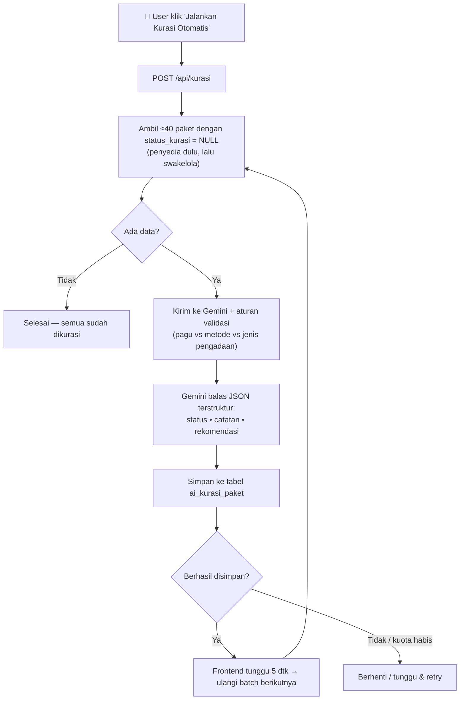
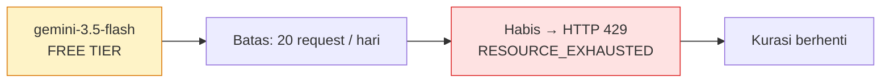
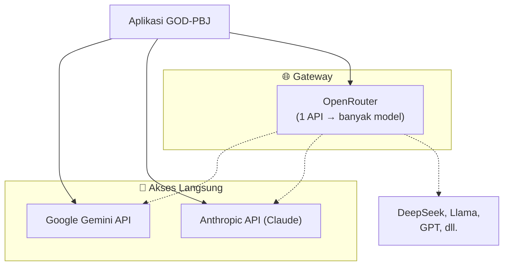
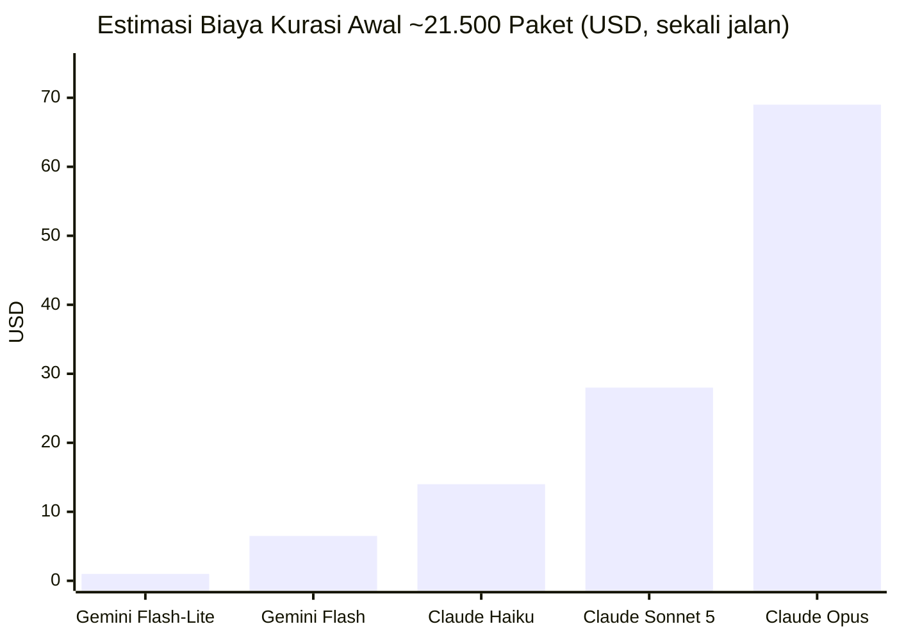
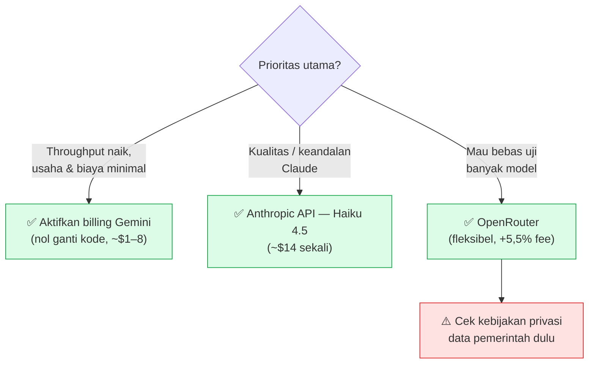

# Laporan Analisis AI Kurasi & Perbandingan Penyedia Model

**Proyek:** GOD-PBJ — Dashboard Pengadaan Barang/Jasa
**Tanggal:** 23 Juli 2026
**Lingkup:** Cara kerja AI kurasi saat ini, perbaikan yang dilakukan, dan perbandingan opsi penyedia AI (Gemini, Claude, OpenRouter)

---

## 1. Ringkasan Eksekutif

Fitur **AI Kurasi** memvalidasi apakah metode pemilihan pada tiap paket RUP sudah sesuai dengan pagu & jenis pengadaan. Saat ini fitur ini berjalan menggunakan **Google Gemini** (`gemini-3.5-flash`).

Hasil analisis:

- ✅ **Mekanisme loop-nya berfungsi** (batching, simpan ke tabel terpisah, tombol henti).
- ⚠️ **Kualitas kurasi awalnya lemah** karena AI dinilai dengan aturan yang datanya tidak dikirim → **sudah diperbaiki**.
- ⚠️ **Kehabisan kuota** saat dijalankan (free tier Gemini = 20 request/hari) → **penanganan error sudah diperbaiki**, tetapi butuh keputusan penyedia untuk skala penuh.

> **Angka kunci:** ± **21.500 paket** perlu dikurasi (sekali jalan). Biaya kurasi penuh berkisar **$1 – $69 sekali** tergantung model — semuanya murah secara absolut.

---

## 2. Cara Kerja AI Kurasi Saat Ini

### Data yang dikurasi

| Aspek | Detail |
|---|---|
| **Sumber data** | Paket **penyedia** (`view_paket_penyedia_master_data`) + **swakelola** (`view_paket_swakelola_master_data`) |
| **Metode tercakup** | E‑Purchasing, Pengadaan Langsung, Penunjukan Langsung, Tender/Seleksi, Swakelola |
| **Field dikirim ke AI** | `kd_rup`, `nama_paket`, `pagu`, `metode_pengadaan`, `jenis_pengadaan`, `status_dikecualikan`, `tipe`, `nama_ppk`, `satker` |
| **Output AI** | `status_kurasi` (Akurat / Tidak Akurat / Belum Dikurasi), `catatan_kurasi`, `rekomendasi_kurasi` |
| **Penyimpanan** | Tabel terpisah `ai_kurasi_paket` (key: `kd_rup`), di-join ke semua view dashboard |

---

## 3. Masalah yang Ditemukan & Perbaikan

| # | Masalah semula | Dampak | Status |
|---|---|---|---|
| 1 | `jenis_pengadaan` tidak dikirim ke AI | Aturan batas nilai tak bisa dinilai → AI menebak | ✅ Diperbaiki |
| 2 | Prompt menilai **kode akun** yang datanya tidak ada | AI "berhalusinasi" | ✅ Prompt dirapikan |
| 3 | Paket **swakelola** tidak pernah dikurasi | Selalu "Belum Dikurasi" | ✅ Diikutkan |
| 4 | Loop berhenti pakai `total_processed` | Risiko loop tak henti saat DB gagal | ✅ Pakai `updated_count` |
| 5 | Batch 100 + tanpa try/catch parse | JSON terpotong → loop mati | ✅ Batch 40 + try/catch + model via env |
| 6 | StatCard angka **dummy** (1.050/150/24) | Progres tak nyata | ✅ Baca hitungan nyata dari DB |
| 7 | Error 429 dikembalikan sebagai HTTP 500 | Loop berhenti total saat kuota habis | ✅ Diteruskan sebagai 429 + retry |

> **Catatan penting:** Validasi **kode akun** tetap tidak bisa dilakukan — datanya memang tidak ada di sumber pengadaan. Perlu impor data anggaran (RKA‑KL) terpisah bila ingin diaktifkan.

---

## 4. Masalah Kuota (Root Cause Error Kemarin)

Error yang muncul **bukan** bug kualitas, melainkan **batas kuota GRATIS**:

- Model `gemini-3.5-flash` **valid** (terbukti dari pesan error).
- Yang habis adalah **jatah harian gratis (20/hari)** — retry tiap 30 detik sia‑sia karena resetnya besok.
- **Solusi nyata:** aktifkan billing / pindah penyedia (lihat bagian berikut).

---

## 5. Perbandingan Opsi Penyedia AI

| Kriteria | Gemini (langsung) | Claude / Anthropic API | OpenRouter |
|---|---|---|---|
| **Perubahan kode** | 🟢 Kecil (sudah dipakai) | 🟡 Ganti SDK | 🟡 Ganti SDK (kompatibel‑OpenAI) |
| **Ganti model** | 🔴 Terkunci 1 provider | 🔴 Terkunci Claude | 🟢 Ganti string saja |
| **Fee perantara** | 🟢 Tidak ada | 🟢 Tidak ada | 🟡 ~5,5% saat top‑up |
| **Kualitas penalaran** | 🟢 Baik | 🟢 Sangat baik | 🟢 Tergantung model dipilih |
| **Privasi data pemerintah** | 🟡 1 pihak | 🟡 1 pihak | 🔴 +1 perantara (model `:free` bisa dipakai training) |
| **Bukan "Pro"** | — | ⚠️ Claude Pro ≠ API (butuh akun API berbayar) | ⚠️ Tetap API per‑token |

---

## 6. Analisis Biaya (Kurasi Awal ± 21.500 Paket)

> Asumsi: ~80 token input & ~110 token output per paket → **≈ 1,8 juta token input** dan **≈ 2,4 juta token output** total. Ini biaya **SEKALI JALAN**; paket baru berikutnya hanya receh.

### Grafik estimasi biaya (USD)

### Rincian

| Model | Harga (in / out per 1 jt token) | Biaya total | Catatan |
|---|---|---|---|
| **Gemini 2.5 Flash‑Lite** | $0,10 / $0,40 | **± $1** | Termurah |
| **Gemini 2.5 Flash** | $0,30 / $2,50 | **± $6–8** | Perubahan kode minimal |
| **Claude Haiku 4.5** | $1 / $5 | **± $14** | Titik masuk Claude paling hemat |
| **Claude Sonnet 5** | $2–3 / $10–15 | **± $28–41** | Kualitas mendekati Opus |
| **Claude Opus 4.8** | $5 / $25 | **± $69** | Overkill untuk validasi aturan |
| **Via OpenRouter** | harga sama + fee ~5,5% | +~5,5% | Bisa `:free` = $0 token (⚠️ privasi) |

> 💡 **Insight:** Bahkan Claude Haiku untuk seluruh dataset ≈ **$14 sekali**. Biaya **bukan penghalang** — keputusannya tentang **kualitas, kepatuhan data, & effort**, bukan uang.

---

## 7. Pohon Keputusan

---

## 8. Rekomendasi

1. **Jangka pendek (paling efisien):** aktifkan **billing Gemini** — kode sudah jalan, cap 20/hari hilang, biaya ± $1–8 untuk seluruh dataset. Cukup naikkan `BATCH_SIZE`.
2. **Jika mengutamakan kualitas Claude:** pindah ke **Anthropic API + Haiku 4.5** (± $14 sekali). Perlu akun API berbayar (**bukan** Claude Pro).
3. **Jika ingin fleksibel bandingkan model:** gunakan **OpenRouter**, tapi **wajib cek kepatuhan privasi** dulu karena ini data pengadaan pemerintah — dan **hindari model `:free`** yang berpotensi memakai data untuk training.
4. **Terpisah dari pemilihan model:** untuk mengaktifkan validasi **kode akun**, siapkan impor data anggaran (RKA‑KL) yang memuat kode akun per RUP.

---

## Lampiran — Sumber Harga

- [AI Cost Check — Gemini Pricing Guide 2026](https://aicostcheck.com/blog/google-gemini-pricing-guide-2026)
- [pricepertoken — Gemini 2.5 Flash](https://pricepertoken.com/pricing-page/model/google-gemini-2.5-flash)
- [ofox.ai — OpenRouter hidden 5.5% fee breakdown 2026](https://ofox.ai/blog/openrouter-pricing-hidden-markup-breakdown-2026/)
- [TrueFoundry — OpenRouter Pricing 2026](https://www.truefoundry.com/blog/openrouter-pricing)

> Estimasi biaya bersifat perkiraan berdasarkan asumsi token; angka aktual bergantung panjang nama paket & catatan yang dihasilkan. Harga model dapat berubah — verifikasi di dashboard masing‑masing penyedia.
